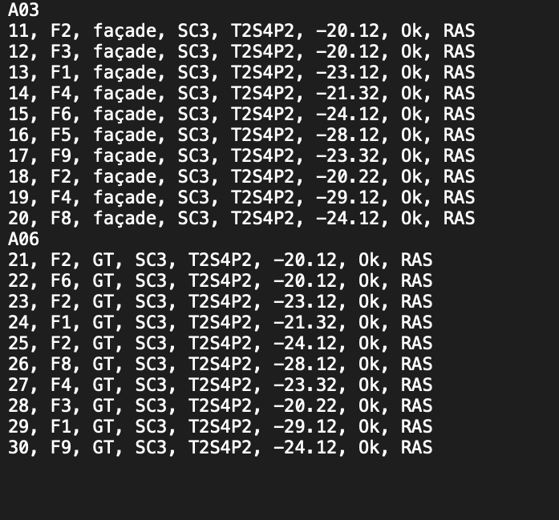

# Gestion automatisée des points de branchemnt optique (PBO)

effectué par ***Alioune MBODJI***


**Tuteur de stage** : ***Patrick NSUKAMI***


**Superviseur académique** : ***Robert THIAW***


**Établissement**: Dakar Institut of Technology DIT


**Entreprise d’accueil**: FREE

### REMERCIEMENTS

En premier lieu, je tiens à remercier M. Patrick , mon professeur en python. En tant que maître de stage, il m’a beaucoup appris et assisté par rapport à la réalisation de ce projet ainsi qu'à mon tuteur Djibril NDIAYE. 

Je saisi cette occasion pour adresser mes profonds remerciements aux responsables et au personnel de l‘école.
Un grand merci à ma mère, ma famille et mes camarades de classe pour leurs conseils ainsi que leur soutien.


#### SOMMAIRE


* 1. Introduction	
* 2. L’environnement de travail	
* 3. Le secteur 
* 4. Présentation 
* 5. Le cadre du stage 	
* 6. Description de la structure sociale	
* 7. Fonctionnement	
* 8. Mise en place de l'application
* 9. Les travaux effectués	
* 10. Les outils et technologies utilisées
* 11. Les Missions du poste occupé	
* 12. Les tâches périphériques	
* 13. Les apports du stage	
* 14. Conclusion	
* 15. Bibliographie	

 
1.  INTRODUCTION

Amorce et présentation du stage
Du 31 Juillet 2022 au 04 Août 2022 (1 mois), j’ai effectué un stage au sein du Dakar Institut of Technology(DIT) (située à la cité Keur Guorgui). 

Fondé en 2019 par le Dr Nicolas POUSSIELGUE, ancien membre de Campus France Paris et spécialiste en informatique, le Dakar Institute of Technology, se donne pour mission de former les prochaines générations de codeurs et de leaders Africains dans l’art d’utiliser la technologie pour le développement autonome de leur continent.

Le Dakar Institute of Technology est une école d’informatique spécialisée dans le Big Data et l’intelligence artificielle (IA), situé à la Cité Keur Gorgui, à proximité immédiate des grands groupes technologiques (Orange, Atos, etc.) implantés au Sénégal.

Les formations enseignées sont principalement sur le Big Data et l’Intelligence Artificielle car ce sont des domaines très demandés sur le marché de l’emploi. 

Au cours de ce stage, j’ai pu m’intéresser aux tâches qui sont directement liées à mon travail notamment le déploiement de la fibre optique au sein de FREE Sénégal (Opérateur de télécommunications). 

  **Les missions :** 

Mon stage consiste principalement à mettre en place un système de gestion automatisé des points de branchement optique dans le cadre du déploiement de la fibre optique de FREE. 
Plus largement, ce stage a été l’opportunité pour moi d’appréhender et de mettre en pratique les connaissances (python, SGBD, devOPS) que j’ai eu à capitaliser au cours de ma première année d’étude en BIG DATA au Dakar Institut of Technology DIT.
Au-delà d’enrichir mes connaissances en développement notamment en python, ce stage m’a permis de comprendre l’impact que pourrait avoir ma formation appliquée à mon métier.

  **Problématique et objectifs du rapport :**

Ce rapport de stage se développe ainsi au prisme de la problématique de comment gérer de manière automatique le déploiement des boîtiers de fibre optique et de faire un récapitulatif de ceux-ci à la fin de chaque semaine en envoyant un courriel à mon N+1. 

En effet c'est tout récemment que FREE s'est lancé dans le déploiement de la fibre optique au Sénégal, ainsi à l'heure actuelle ils n'ont pas un systéme informatisé de leur infrastructure optique. 
De ce fait l'enregistrement de ces boîtiers à travers une base de données locale reste une tâche assez fastidieuse et avec une eventualité de taux d'erreurs conséquent.


  **Annonce du plan :**

En vue de rendre compte de manière fidèle et analytique de la période passée au sein de DIT, il apparaît logique de présenter à titre préalable l’environnement de travail, à savoir le secteur des télécommunications notamment l'historique de FREE, puis le cadre du stage au sein du DIT, aussi les  différentes missions et tâches que j’ai pu effectuer. 


2. L’environnement de travail
  3. Le secteur : Les télécommunications
  4. Présentation de FREE :

Free au Sénégal est un opérateur global de Téléphonie mobile au Sénégal. Il compte aujourd’hui plus de 4 millions de clients qui utilisent tous les jours ses services mobiles, internet et financiers. 
En avril 2018, Tigo Sénégal devenu free est cédé à Saga Africa Holdings Limited, un consortium Sénégalo-Franco-Malgache.

Axian, groupe malgache appartenant à la famille Hiridjee, est présent à Madagascar et dans l’océan Indien à travers 4 secteurs d’activités : les télécoms, les services financiers, l’immobilier et l’énergie. Dans le domaine des télécoms, l’entreprise Telma se positionne comme le premier opérateur malgache grâce à ses offres mobiles et son réseau fibre optique le plus rapide d’Afrique. 

Comme expliqué tantôt, c'est tout récemment que FREE Sénégal c'est lancé dans le déploiement de la fibre optique (FTTH: Fiber To The Home). 
Il s’agit d’une technologie innovante qui permet le transfert de données sur des grandes distances à une vitesse inégalée. Elle  vous offre une connexion stable avec un meilleur débit.


5. Le cadre du stage :
  6. Description de la structure sociale de DIT :

L’école DIT regroupe un effectif de 12 employés, qui sont divisés départements, tous sous la direction du directeur général.
-         Directeur général
-         Directeur des études 
-         Responsable 
-         
-         
  7. Fonctionnement :

Au sein de cette société, il est aisé de percevoir l’interaction constante entre les différents départements décrits plus haut.
Compte tenu du fait que mon stage a été exclusivement réalisé dans le cadre de mon travail professionnel, je vais plus m’atteler aux aspects techniques (mise en place du projet ainsi qu’aux travaux effectués)


  8. Mise en place de l'application :
  9. Les travaux effectués :

Au cours de ce stage, j’ai eu l’opportunité de découvrir la multitude de solutions que pourrait m’offrir l’IA appliqué aux télécommunications. Pour une meilleure compréhension des tâches que j’ai pu effectuer, il apparaît approprié de traiter en premier lieu des outils qui étaient mis à ma disposition, puis de traiter de manière détaillée les tâches que j’ai pu effectuer.

  10. Les outils et technologies utilisés :

Au cours de ce stage, j’ai pu bénéficier d’une bonne documentation sur la mise en place d’une base de données SQLite, les fondamentaux du language Python ainsi que sur la façon de réaliser une application web avec Flask sur Python. 

 De plus des données que m’ont fourni FREE dans le cadre du déploiement du réseau optique. 

  ***Présentation des outils :***

  **SQlite :**

  SQLite est un système de base de données qui a la particularité de fonctionner sans serveur, on dit aussi "standalone" ou "base de données embarquée".
  L'intérêt c'est que c'est très léger et rapide à mettre en place, on peut s'en servir aussi bien pour stocker des données dans une vraie base de données ou sur une application.
  Une base de données SQLite est bien plus performante et facile à utiliser que de stocker les données dans des fichiers XML ou binaires, d'ailleurs ces performances sont même comparables aux autres SGBD fonctionnant avec un serveur comme MySQL, Microsoft SQL Server ou PostgreSQL.
  L'autre avantage est la simplicité : il n'y a aucune manipulation à faire, le fichier sqlite est créé automatiquement à la volée, toute la base est stockée dans un fichier unique qu'il est facile d'échanger en FTP.

  **Flask :**

  Flask est un petit framework web Python léger, qui fournit des outils et des fonctionnalités utiles qui facilitent la création d'applications web en Python. Il offre aux développeurs une certaine flexibilité et constitue un cadre plus accessible pour les nouveaux développeurs, puisque vous pouvez construire rapidement une application web en utilisant un seul fichier Python. (technologie non utilisée sur ce projet.)

  **Python :**
  Python est un langage de programmation open source créé en 1991.
  En effet, Python est un langage qui prend en charge la gestion et la manipulation de données volumineuses et certaines de ses fonctions gèrent le traitement d’informations multiples de manière automatisée ainsi que la collecte et le nettoyage de données. Il permet notamment la modélisation de ces données et est très utilisé en Data Visualization. 

  Python est majoritairement utilisé dans l’écriture de scripts qui permettent l’automatisation de systèmes de fichiers. Cependant, c’est loin d’être les seules utilités de ce langage. D'ailleurs nous allons nous servir d'un script qui nous permettra de formater notre "input: saisie de donnée " et de le stocker au niveau de la base SQlite.


  11. Les Missions :

  ***Présentation :***

Comme il a été précisé en introduction, ma mission principale est de superviser le déploiement du réseau optique de l’opérateur FREE de bout en bout. Ainsi dans cette optique, j’ai pu constater qu’il était nécessaire d’automatiser certaines tâches fastidieuses. Notamment la phase de recette qui se déroule à la fin de chaque semaine. 
Cette phase a pour principalement objectif de recenser tous les boitiers qui ont été déployés au niveau des différentes zones de déploiement.  

En relevant les éléments suivants : le numéro du boitier, le nom de la plaque, le central sur lequel le boîtier est raccordé, la mesure prise sur une fibre du boitier, le port concerné, la nature de l’infrastructure (type PBO), le statut (rejeté ou non) et la partie commentaire.  

Au cours de ce projet, différentes sortes de tâches seront realisées :

-         Définir un format d’input bien défini afin d'enregistrer les PBO.
-         Ecrire un script en python qui nous permettra d'envoyer automatiquement les données saisies.
-         Stocker les données au niveau de la base SQlite.
-         Envoyer un courriel récapitulatif sur l’état d’avancement des travaux: le nombre de PBO raccordés.

12. Les tâches périphériques :

  **Définir un format d'input :**

  Dans cette partie, nous allons définir un format de données (.txt) bien spécifique afin de pouvoir écrire un script python qui va les classifier selon un type et les stocker dans la base SQlite.
  Le format de texte sera essentiellement composé de deux parties: 
    - La plaque(zone).
    - Les éléments spécifiques à chaque plaque: numéro PBO, numéro fibre, la nature de l'infrastructure (type PBO), le central sur lequel le boîtier est raccordé, le port auquel le PBO est branché (côté central), la mesure prise sur une fibre du boitier, le statut (rejeté ou non) et la partie commentaire.  
  - Illustration: 

  {width=6in}

  **Script Python :**

  A ce niveau, nous allons à travers les notions de liste et de boucles faire un formatage de notre input, ensuite les stocker sur une variable avant de les téléverser au niveau de la base SQlite.
  - Voir code ci-dessous:
  
```python
print("toto")
```

**Stockage des données au niveau de SQlite :**

On va créer une table nommée "déploiement_FTTH" ou on va sauvegarder les données téléverser par notre script python. 

Comme varibales au niveau de la base on aura: nom_plaque, numéro_PBO, numéro_fibre, type_PBO, central_optique, port_ODF, mesure_optique, statut et commentaire.

- Illustration: 

{width=6in}


**Envoie courriel automatique :**

Aprés traitement et stockage des données au niveau de la base, la dernière étape consisterait à envoyer un courriel récapitulatif de l'état d'avancement du déploiement du réseau optique(avec le nombre de PBO sur chaque plaque). Et ce de manière cyclique, c'est à dire à la fin de chaque semaine. 

Voir le code ci-dessous: 

```python
print("toto")
```


13. Les apports du stage

  ***Les compétences : *** 

Au cours de ce projet, j’ai beaucoup appris. Les apports que j’ai tiré de cette expérience professionnelle et académique peuvent être regroupés autour de trois idées principales : les compétences acquises, les difficultés rencontrés et solutions apportées ainsi que la vie en société.

Ce stage m’a permis de consolider mes connaissances apprises au cours de cette première année d’étude en informatique spécialisation BIG DATA plus précisément en python et à la tenue d’une base de données. Aussi en termes de savoir-faire, j’ai pu apporter une plus-value à mon métier notamment avec un gain de temps considérable et très grande efficience. 

  ***Difficultés rencontrées et solutions apportées :***  

Les difficultés rencontrées sont principalement liées à l’élaboration du plan de travail, c’est-à-dire comment définir l’enchaînement des étapes à la suite des autres, la réalisation de l’interface web avec python(partie non effectuée) et le délai de réalisation du rapport compte tenu de mon calendrier professionnel et scolaire.

Comme solution, j’ai pu bénéficier du support de mon professeur, qui m’a orienté sur mes recherches ainsi qu’à la compréhension de mes supérieurs hiérarchiques.

  ***La vie en société :*** 

Mon stage chez DIT a été très instructif. Au cours de cette période j’ai ainsi pu observer le fonctionnement d’une société en l’occurrence l’école]. Par ailleurs, les relations humaines entre les différents employés, indépendamment de l’activité exercée par chacun d’eux, m’a appris sur le comportement à avoir en toute circonstance.


14. Conclusion 

  **Résumé global :** 

Pour conclure, j’ai effectué mon stage de ma première année en BIG DATA au sein de l’école (DIT) en apportant une plus-value à mon métier de superviseur déploiement fibre optique chez FREE. Lors de ce stage d’un (1) mois, j’ai pu mettre en pratique mes connaissances théoriques acquises durant ma formation au Dakar Institut of Technology (DIT), tout en étant confronté aux difficultés réelles du monde du travail.

  **Apport et bilan :**

Ce stage a été très enrichissant pour moi, car il m’a permis d’entreprendre, m’a imprégné sur les métiers du BIG DATA et de l’IA et leurs impacts. Il m’a permis de participer concrètement à la résolution d’un problématique majeur dans le cadre de mon travail. Et m’a aussi permis d’échelonner les paliers professionnellement avec un curriculum vitae beaucoup plus enrichissant.

  **Réponse à la problématique :**

Cette expérience m’a permis de répondre aux questionnements que j’avais en ce qui concerne les moyens utilisés par les entreprises pour s’adapter à l’évolution des TIC notamment avec l’avènement de l’IA. Ainsi cela a contribué fortement à résoudre la gestion de l’infrastructure optique avec une très grande efficacité. 

  **Perspective :**

A la fin de mon stage, l’objectif serait la mise en place de l’interface web (avec Flask) et de rajouter des fonctionnalités à savoir la partie exploitation de la fibre optique : gestion des abonnés en plus de la partie déploiement.

15. Bibliographie

1.	https://nskm.xyz/documents/sql-introduction.pdf
2.	https://python.developpez.com/tutoriel/intro-flask-python3/#LVI
3.	Fichier de recette des points de branchement optique.
4.	Cours Python 
 


